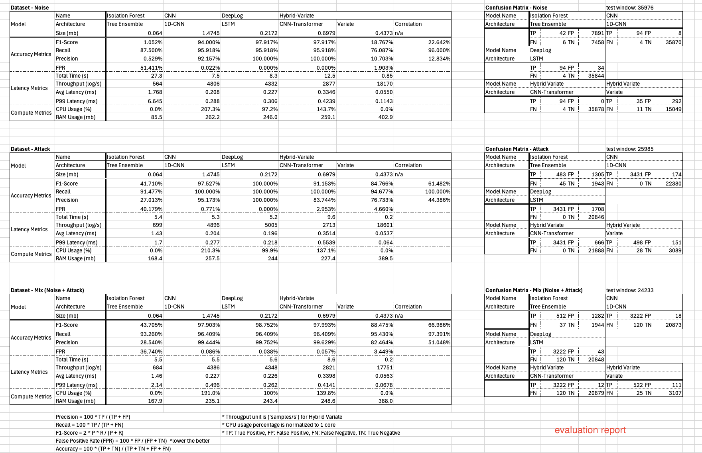

**Visit [here](https://lat-pulldown.github.io/otlab) for full setup guide.**  

---

## Prerequisite
Python 3.8+
Install necessary libraries with
```
pip install -r requirements.txt
```

## Dataset
Contains 1 training and 3 testing datasets
* `train.csv`: Normal polling
* `noise.csv`: External traffic to Conpot
* `attack.csv`: Emulated cyber attacks from Caldera-OT
* `mix.csv`: Mix of noise and attack
* `_tf.csv`: For isolation forest and variate models

## Setup: Evalutating each models
**Default dataset:** `mix.csv`  

Change with `-data XX.csv` (`-cyber XX.csv -phys YY.csv` for fusion_test.py)

### 1. Isolation Forest
- Navigate to the directory:
```cd /otlab/iforest```
- Train with
```python3 iforest.py -mode train```
- Test with
```python3 iforest.py -mode test```

### 1. 1D-CNN
- Navigate to the directory:
```cd /otlab/cnn```
- Train with
```python3 cnn_train.py```
- Test with
```python3 cnn.py```

### 1. DeepLog
- Navigate to the directory:
```cd /otlab/deeplog```
- Train with
```python3 model_train.py```
- Test with
```python3 model_test.py```

### 1. Hybrid Variate
- Navigate to the directory:
```cd /otlab/hyvar```
#### 1D-CNN-Transformer
- Train with
```python3 hybrid_train.py```
- Test with
```python3 hybrid_test.py```
#### Tempurature-Variate
- Train with
```python3 var_train.py```
- Test with
```python3 var_test.py```
#### Correlation Test
- Test with 
```python3 fusion_test.py```

## Evaluation Results


